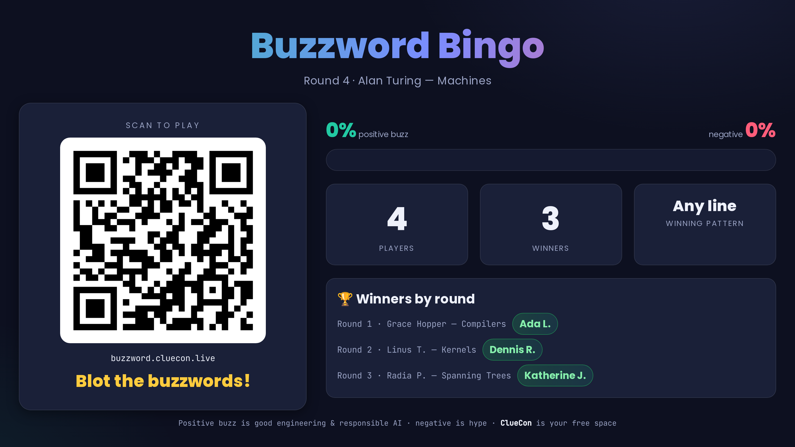
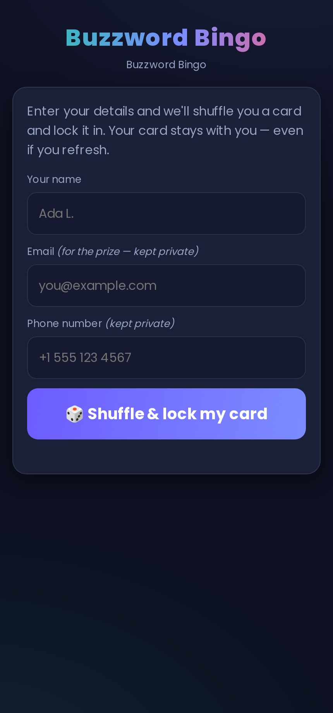
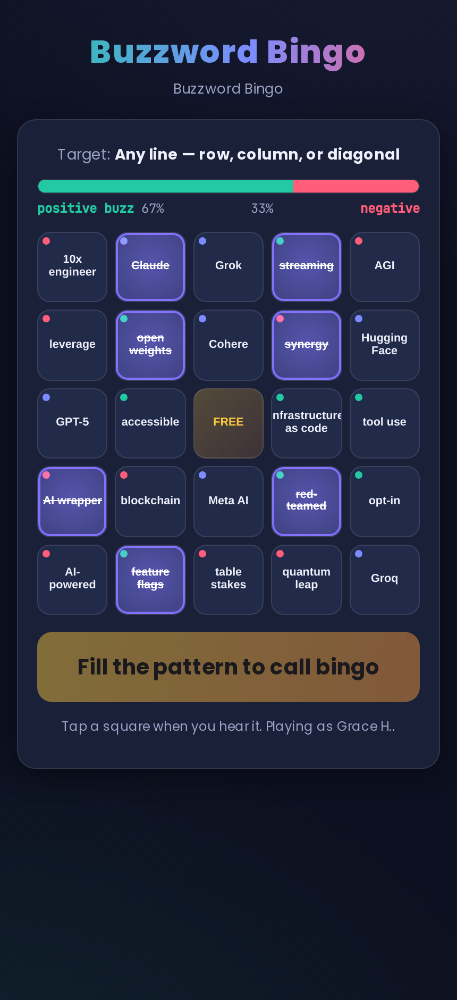
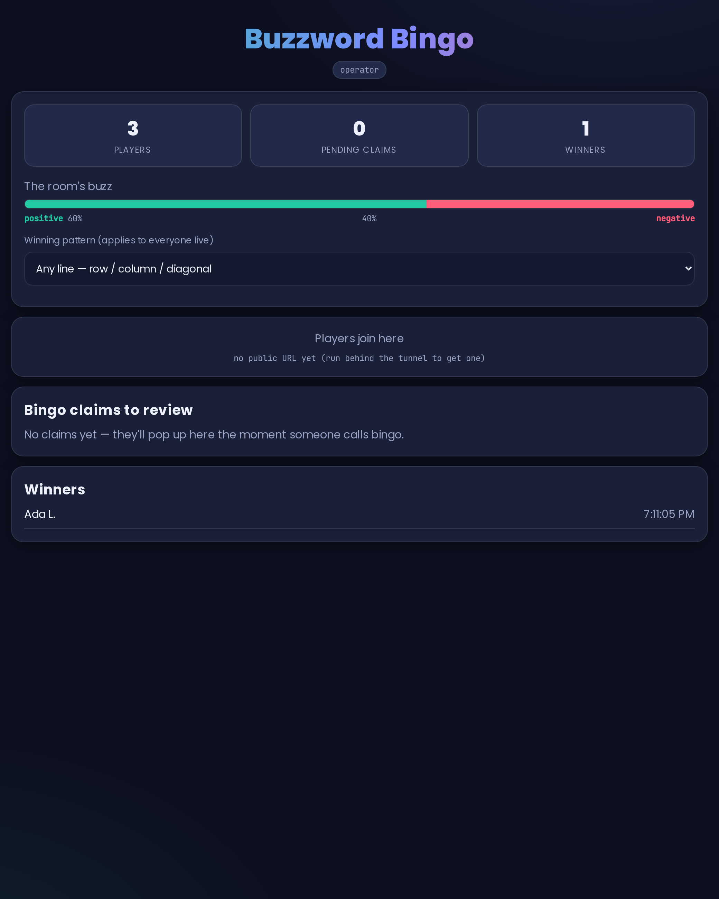

<!-- markdownlint-disable MD033 MD041 -->
<h1 align="center">🟩 Buzzword Bingo</h1>

<p align="center">
  <b>Live audience bingo for talks.</b><br/>
  Scan a QR, draw a card that locks to you, and blot buzzwords as the speaker says
  them. Positive buzz is good engineering &amp; responsible AI; negative is hype;
  AI names are free-for-alls — and the room's <i>buzz sentiment</i> updates live.
</p>



---

## Table of contents

- [The idea](#the-idea)
- [The surfaces](#the-surfaces)
- [How the card algorithm works](#how-the-card-algorithm-works)
- [How a game runs](#how-a-game-runs)
- [Quick start](#quick-start)
- [Configuration](#configuration)
- [Data model](#data-model)
- [Security notes](#security-notes)
- [Project layout](#project-layout)

---

## The idea

A speaker gives a talk. The audience plays bingo against the buzzwords. Each
square is a word the speaker might drop — and words come in three flavors:

- 🟢 **Positive** — buzzwords worth celebrating (open source, low-latency, evals, guardrails…)
- 🔴 **Negative** — groan-worthy hype (synergy, web3, "sprinkle some AI", 10x engineer…)
- 🔵 **Name-drops** — AI companies & models (OpenAI, Claude, Gemini, Llama, DeepSeek…)

Players tap squares as they hear them. Every blot feeds a **live buzz sentiment**
— the positive-vs-negative ratio of what's actually been said — which the Stage
screen shows the whole room. First to complete the winning pattern calls
**BINGO**, an organizer eyeballs their card, approves, and they win a prize. The
free center square is **ClueCon**.

Identity is a UUID in a cookie, and the card + every blot live in a database, so
**a refresh never loses your game.**

---

## The surfaces

| Surface | Route | Who |
|---|---|---|
| **Play** | `/` | The audience, on their phones |
| **Stage** | `/stage` | The projector — join QR, live buzz, winners |
| **Operator** | `/operator` | The booth — set the pattern, review & approve bingos |

### 📱 Play — the audience

Enter name / email / phone, and we shuffle a card and **lock it in**. Tap squares
to blot; the meter shows the buzz you've heard so far. Reload-safe.

<p align="center">
  
  &nbsp;&nbsp;
  
</p>

Each square carries a colored dot for its polarity (🟢 positive / 🔴 negative /
🔵 name-drop); blotted squares are struck through and glow.

### 🎛️ Operator — the booth

Pick the winning pattern (applies to everyone live), watch the room's buzz, and
**review each bingo claim** — you see the claimant's card, exactly which words
they blotted, and the pattern they completed — then approve or reject. You can
also **add buzzwords live** (positive / negative / name-drop), **label each round
with the speaker/topic**, and hit **Next speaker** to deal everyone a fresh card
from the updated pool. The Stage keeps a running **Winners by round** board
(e.g. "Round 2 · Grace Hopper — Compilers → Ada L.").



---

## How the card algorithm works

The whole algorithm is a small, dependency-free module (`bingo.js`):

1. **Deterministic per player.** A card is generated from a seeded RNG keyed on
   the player's UUID, so the same UUID always yields the identical card. The DB
   copy is just a fast cache — the card can always be re-derived.
2. **Three pools, one card.** ~30% of the 24 word cells are neutral AI
   **name-drops**; the rest split **positive / negative** (default proportional
   to pool sizes, configurable via `positiveRatio`). Fisher–Yates lays them out;
   the center is the **ClueCon** free space.
3. **Two percentages:**
   - **Card composition %** — positive vs negative of the card's buzz words
     (name-drops are neutral and excluded).
   - **Live buzz sentiment %** — of the words a player has *blotted so far*,
     how positive. Summed across everyone, that's the room's live sentiment on
     the Stage.
4. **Traditional patterns.** `evaluate()` detects any line (row / column /
   diagonal), four corners, X, plus, full frame, or blackout — the free center
   counts as marked. The operator picks the active target; the server
   **re-validates every claim** (it never trusts the client).

```js
const card = generateCard(uuid);           // deterministic, locked to the player
card.positivePct;                           // e.g. 47  (composition, names excluded)
evaluate(card, marked, 'any_line').complete // true when a row/col/diag is filled
sentiment(card, marked).positivePct         // live buzz of what they've blotted
```

Edit the starting word pools in `buzzwords.js` — `POSITIVE`, `NEGATIVE`, `NAMES` —
or add words on the fly from the operator panel (stored in the DB, merged into
the pools when cards are drawn).

---

## How a game runs

1. **Join** — audience scans the Stage QR → `/`.
2. **Register & lock** — name + email + phone → card shuffles and locks in.
3. **Blot** — tap squares as the speaker says them; buzz meter updates live.
4. **Call BINGO** — when the pattern is complete, the player claims.
5. **Review** — the server confirms the pattern; an operator approves the card.
6. **Win** — the winner lights up the Stage. 🏆

The operator can change the winning pattern mid-talk; every player's card
re-evaluates against the new target instantly.

---

## Quick start

**Prerequisites:** Docker.

```bash
cd buzzword-bingo
./run.sh
```

`run.sh` builds the image, creates a `.env` with a random `OPERATOR_KEY`, opens a
public cloudflared tunnel, and prints the join URL. Then open:

- **Stage** → `http://localhost:3200/stage` (put it on the projector)
- **Operator** → `http://localhost:3200/operator` (enter your `OPERATOR_KEY`)
- Players scan the QR on the Stage (or the printed public URL).

> **Offline / LAN demo:** set `NO_TUNNEL=1` in `.env` to skip the public tunnel.

Run it by hand instead:

```bash
docker build -t buzzword-bingo .
docker run --rm --name buzzword-bingo \
  --env-file .env -p 3200:3200 \
  -v buzzword-bingo-data:/data \
  buzzword-bingo
```

---

## Configuration

Environment variables (via `--env-file .env`; `.env` is git-ignored):

| Variable | What it does |
|---|---|
| `OPERATOR_KEY` | Key for `/operator`. `openssl rand -hex 16` |
| `PORT` | Server port (default `3200`) |
| `NO_TUNNEL` | `1` = LAN-only, no public tunnel |
| `PUBLIC_URL` | Pin a stable URL (e.g. a named tunnel); blank = auto quick-tunnel |
| `DATA_DIR` | Where the SQLite DB lives (mapped to a Docker volume) |

---

## Data model

SQLite (`better-sqlite3`), one file in the `/data` volume — a refresh or restart
never loses state:

- `players(uuid, name, email, phone, created_at)`
- `cards(uuid, layout_json, positive_pct, negative_pct, locked, created_at)`
- `game_state(uuid, marked_json, won_at, updated_at)`
- `claims(id, uuid, pattern, status, claimed_at, reviewed_at)`
- `meta(key, value)` — the active pattern, event name, etc.

---

## Security notes

- **PII stays private.** Email/phone live server-side; the Stage's public feed
  carries winner **names only** — never emails.
- **Secrets out of the image.** Config is a git-ignored `.env`, passed at
  runtime, never `COPY`-ed in.
- **Server-authoritative wins.** Bingo claims are re-validated on the server, so
  a tampered client can't fake a pattern; the operator still eyeballs the card.
- **Hardening.** Strict CSP + security headers, HttpOnly `SameSite=Lax` cookie,
  input sanitization, a rate-limited mark endpoint, key-gated operator API, and
  the container runs as a **non-root** user.

---

## Project layout

```
.
├── server.js        # Express + Socket.IO control server
├── bingo.js         # the card algorithm (pure, no deps)
├── buzzwords.js     # POSITIVE / NEGATIVE / NAMES word pools — edit me
├── db.js            # SQLite persistence (better-sqlite3)
├── public/
│   ├── play.html/.js     # audience app
│   ├── stage.html/.js    # projector screen
│   ├── operator.html/.js # booth console
│   └── app.css
├── Dockerfile       # multi-stage: build native deps, lean runtime + cloudflared
├── entrypoint.sh    # boot app + tunnel, hand the URL back for the QR
├── run.sh           # build + run helper
└── .env.example
```

---

<p align="center"><sub>Buzzword Bingo · a little game for talks</sub></p>
